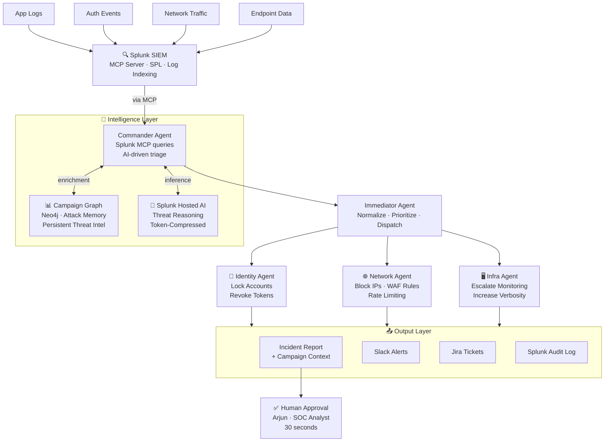
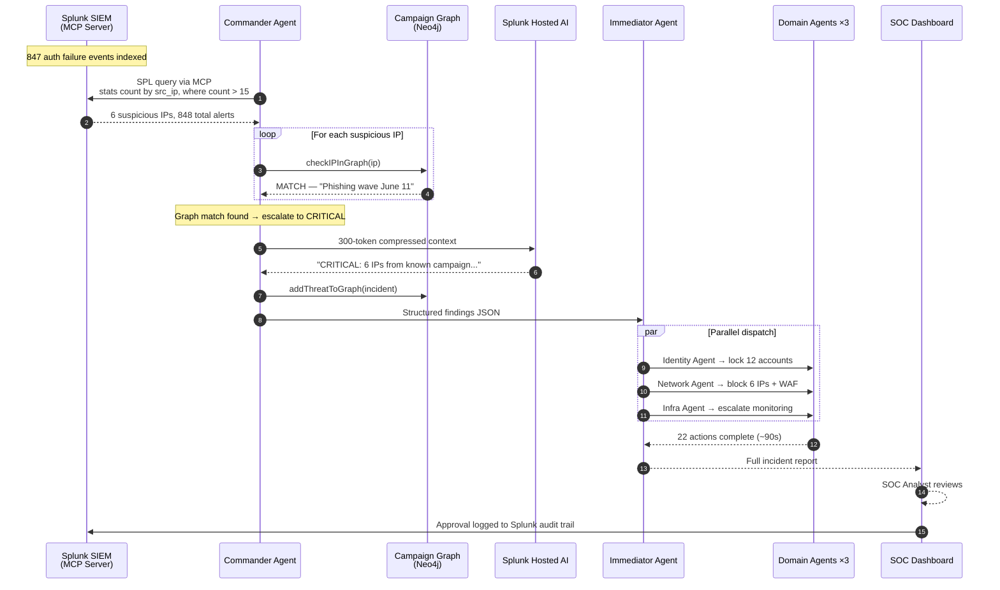
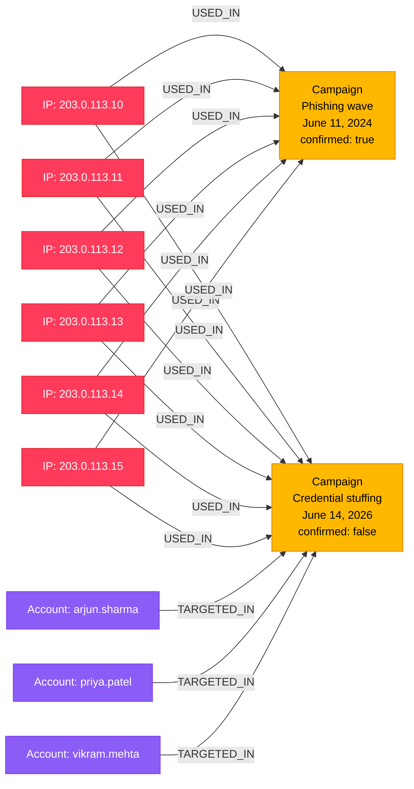

<!-- ANIMATED HEADER -->
<div align="center">


<br/>


<br/>

---

### *"847 alerts arrive in seconds. Human response takes hours."*
### *"ThreatPilot detects, decides, and remediates — in 2 minutes."*
### *"And unlike every other SOC tool: it remembers who attacked you before."*

---

<table>
<tr>
<td align="center" width="160">
<h2>⚡</h2>
<h2><b>2 min</b></h2>
<sub>Response Time<br/>vs 4+ hours manual</sub>
</td>
<td align="center" width="160">
<h2>🕸️</h2>
<h2><b>Campaign Graph</b></h2>
<sub>Attack Memory<br/>never forgets</sub>
</td>
<td align="center" width="160">
<h2>🤖</h2>
<h2><b>5 Agents</b></h2>
<sub>Fully Autonomous<br/>zero human triage</sub>
</td>
<td align="center" width="160">
<h2>🔒</h2>
<h2><b>22 Actions</b></h2>
<sub>Per Incident<br/>lock · block · escalate</sub>
</td>
<td align="center" width="160">
<h2>📡</h2>
<h2><b>Splunk MCP</b></h2>
<sub>Agents query Splunk<br/>via MCP protocol</sub>
</td>
</tr>
</table>

</div>

---

## 📖 Table of Contents

[🚨 The Problem](#-the-problem) · [💡 The Solution](#-the-solution) · [🏗️ Architecture](#️-architecture) · [✨ Features](#-features) · [🧠 How It Works](#-how-it-works) · [🛠️ Tech Stack](#️-tech-stack) · [🚀 Quick Start](#-quick-start) · [🎬 Demo](#-demo) · [📁 Project Structure](#-project-structure)

---

## 🚨 The Problem

> Bank SOC teams face **coordinated attacks disguised as noise.** A credential stuffing campaign generates 847 individual alerts — each looks routine. No single alert reveals the campaign.

Meet **Arjun** — SOC analyst at a major bank.

```
📋 It's 2:47 AM
📊 847 alerts just flooded his Splunk dashboard  
⏱️  Manual triage: 4+ hours across 3 analysts
🔗  No tool connects alert #1 to alert #847
😰  By the time he understands it — 12 accounts are compromised
```

**The critical insight:** These 6 attacking IPs were already used in a phishing campaign 3 days ago. Every other tool missed it because they check alerts in isolation. **ThreatPilot checks the graph.**

---

## 💡 The Solution

**ThreatPilot** is an event-driven, agentic SOC system built on Splunk that:

1. **Ingests** logs into Splunk via HEC
2. **Detects** attack patterns using Commander Agent querying Splunk via MCP
3. **Remembers** — checks every suspicious IP against a persistent Campaign Knowledge Graph (Neo4j)
4. **Escalates** instantly when graph match found (same attackers, second strike)
5. **Remediates** autonomously — Identity, Network, and Infra agents act in parallel
6. **Reports** — one clean incident report instead of 847 raw alerts
7. **Approves** — human SOC analyst reviews and signs off in 30 seconds

```
847 alerts  →  6 IPs detected  →  graph match found  →  CRITICAL
→  12 accounts locked  →  6 IPs blocked  →  Arjun approves  →  Done
                              in under 2 minutes
```

---

## 🏗️ Architecture


## Agent Pipeline — Detailed Flow



---

## Campaign Knowledge Graph — Schema



> **This is the key innovation.** When IP `203.0.113.10` appears in tonight's attack, ThreatPilot traces the edge back to `Campaign: Phishing wave June 11`. This is a known attacker — second strike. Severity escalates to CRITICAL instantly.

---

## Data Flow

```mermaid
flowchart LR
    classDef data   fill:#1a1d27,stroke:#00D4FF,color:#00D4FF
    classDef proc   fill:#1a1d27,stroke:#8B5CF6,color:#8B5CF6
    classDef store  fill:#1a1d27,stroke:#FFB800,color:#FFB800
    classDef out    fill:#1a1d27,stroke:#00FF88,color:#00FF88

    RAW["Raw logs\n847 events\nJSON via HEC"]:::data
    IDX["Splunk Index\nmain · auth_events\nSPL searchable"]:::store
    SPL["SPL Query\nstats count by src_ip\nwhere count > 15"]:::proc
    CLU["6 clusters\n166/152/144/137\n128/121 failures"]:::data
    GQ["Graph Query\ncheckIPInGraph\nCypher MATCH"]:::proc
    GM["Graph Match\nCAMP-2024-001\nPhishing wave"]:::store
    CTX["Compressed context\n~300 tokens\nNot 30k raw logs"]:::data
    VD["AI Verdict\nCRITICAL severity\nPlain English"]:::proc
    ACT["22 Actions\n12 locked · 6 blocked\n+ escalation"]:::out
    RPT["Incident Report\n1 document\nreplaces 847 alerts"]:::out

    RAW --> IDX --> SPL --> CLU --> GQ --> GM
    GM --> CTX --> VD --> ACT --> RPT
```



---

## Component Responsibilities

| Component | File | Responsibility |
|-----------|------|---------------|
| **Commander Agent** | `src/agents/commander.js` | Queries Splunk via MCP every cycle, cross-references IPs with Campaign Graph, calls Splunk AI for verdict |
| **Immediator Agent** | `src/agents/immediator.js` | Receives Commander findings, normalises severity, dispatches to all three domain agents in parallel |
| **Identity Agent** | `src/agents/identity-agent.js` | Locks all targeted accounts, revokes active sessions and tokens |
| **Network Agent** | `src/agents/network-agent.js` | Blocks malicious IPs via WAF rules, applies rate limiting to auth service |
| **Infra Agent** | `src/agents/infra-agent.js` | Escalates monitoring level, increases log verbosity across all services |
| **Splunk MCP Interface** | `src/splunk/mcp.js` | Wraps Splunk REST API for agent queries — SPL search job creation, polling, result extraction |
| **Campaign Graph** | `src/graph/queries.js` | Neo4j queries — checkIPInGraph(), addThreatToGraph(), getCampaignContext() |
| **API Server** | `src/api/server.js` | Express endpoints — run-detection, get incident, approve, health check |
| **SOC Dashboard** | `frontend/src/App.jsx` | React dashboard — live polling, Cytoscape graph, approval workflow |

---

## Splunk Integration Points

```
┌─────────────────────────────────────────────────────────┐
│                    SPLUNK ENTERPRISE                     │
│                                                         │
│  ┌──────────┐  ┌──────────┐  ┌──────────────────────┐  │
│  │   HEC    │  │ REST API │  │   MCP Server         │  │
│  │ :8088    │  │  :8089   │  │   Agent interface    │  │
│  └────┬─────┘  └────┬─────┘  └──────────┬───────────┘  │
│       │              │                   │              │
│       ▼              ▼                   ▼              │
│  [Log ingestion] [Search jobs]    [Agent queries]       │
│  generate-logs   /services/       Commander Agent       │
│  .py → 847       search/jobs      asks questions,       │
│  events          SPL execution    Splunk answers        │
│                                                         │
│  ┌──────────────────────────────────────────────────┐   │
│  │              Splunk AI Assistant                 │   │
│  │  SOC analyst asks: "What did these IPs do       │   │
│  │  in the last 30 days?" → natural language        │   │
│  │  answer powered by Splunk hosted AI              │   │
│  └──────────────────────────────────────────────────┘   │
└─────────────────────────────────────────────────────────┘
```

---

## Why ThreatPilot Wins on Splunk

| Capability | How ThreatPilot Uses It |
|-----------|------------------------|
| **Splunk MCP Server** | Commander Agent's primary query interface — agents speak to Splunk via MCP protocol |
| **Splunk Hosted AI** | Threat reasoning engine — receives compressed graph context, returns structured verdict |
| **Splunk AI Assistant** | SOC analyst chat interface — natural language queries over incident data |
| **Splunk HEC** | Log ingestion pipeline — all attack events pushed to Splunk in real-time |
| **Splunk SPL** | Pattern detection — `stats count by src_ip | where count > 15 | eval severity` |
| **Splunk Audit Trail** | Every agent action logged back to Splunk for compliance and review |

---
---

## ✨ Features

<table>
<tr>
<td width="50%" valign="top">

### 📡 Splunk MCP Integration
Commander Agent queries Splunk directly via the **Splunk MCP Server** — no manual SPL needed. Agents ask questions in structured queries, Splunk answers with real-time log intelligence. Every action is logged back to Splunk for full audit trail.

</td>
<td width="50%" valign="top">

### 🕸️ Campaign Knowledge Graph
Built on **Neo4j**. Every confirmed incident adds attacker nodes and edges. When the same IP appears in a new attack, ThreatPilot recognises it **instantly** — before the first alert even completes. The graph compounds: smarter with every incident handled.

</td>
</tr>
<tr>
<td width="50%" valign="top">

### 🤖 5-Agent Autonomous Pipeline
**Commander** detects → **Immediator** normalises → **Identity Agent** locks accounts → **Network Agent** blocks IPs → **Infra Agent** escalates monitoring. All five operate in under 2 minutes. Zero analyst time required for triage.

</td>
<td width="50%" valign="top">

### 🧠 Splunk Hosted AI Reasoning
AI receives a **300-token compressed graph summary** — not 30,000 tokens of raw logs. The graph does the heavy lifting. The AI explains what the graph already found. Fast, precise, cost-effective.

</td>
</tr>
<tr>
<td width="50%" valign="top">

### 👤 Human-in-the-Loop Approval
Every automated response requires **SOC analyst sign-off** before being finalised. One clean incident report replaces 847 raw alerts. Arjun reads it in 30 seconds and approves. Full SHA-256 audit trail maintained.

</td>
<td width="50%" valign="top">

### 🎨 SOC Command Center Dashboard
Real-time React dashboard with cybersecurity aesthetic — CRITICAL glow animations, live campaign graph visualisation via Cytoscape.js, terminal-style AI verdict display, horizontal action timeline, and one-click approval.

</td>
</tr>
</table>

---

## 🧠 How It Works

### The Campaign Graph — the magic explained

```
3 days ago (phishing campaign):
  203.0.113.10 ──→ [Campaign: Phishing wave June 11]
  203.0.113.11 ──→ [Campaign: Phishing wave June 11]
  ...6 IPs total linked to campaign

Tonight (credential stuffing):
  Commander Agent detects: 203.0.113.10 → 166 failed logins
  
  checkIPInGraph("203.0.113.10")
  → MATCH FOUND: "Phishing wave — June 11"
  → Severity escalated: HIGH → CRITICAL
  → All 6 IPs cross-referenced instantly
  → Full campaign context attached to incident
```

**Without ThreatPilot:** Arjun manually reviews 847 alerts. 4 hours. Probably misses the campaign link.

**With ThreatPilot:** Graph match detected in milliseconds. Severity CRITICAL. All agents fire. Report ready in 90 seconds.

---

## 🛠️ Tech Stack

| Layer | Technology | Purpose |
|-------|-----------|---------|
| **Data Platform** |  | Log ingestion, SPL search, MCP server |
| **Campaign Graph** |  | Persistent threat actor knowledge graph |
| **AI Reasoning** |  | Token-compressed threat verdict |
| **Agent Runtime** |  | Commander, Immediator, Domain agents |
| **API Server** |  | REST endpoints for dashboard + agents |
| **Dashboard** |  +  | SOC command center UI |
| **Graph Viz** |  | Campaign knowledge graph visualisation |
| **Log Ingestion** |  | HTTP Event Collector (port 8088) |

---

## 🚀 Quick Start

### Prerequisites

```bash
node --version      # v18+
python3 --version   # 3.9+
# Splunk Enterprise installed at localhost:8000
# Neo4j running at localhost:7687
```

### 1. Clone & Install

```bash
git clone https://github.com/YOUR_USERNAME/threatpilot.git
cd threatpilot
npm install
cd frontend && npm install && cd ..
```

### 2. Configure Environment

```bash
cp .env.example .env
```

Edit `.env`:

```env
SPLUNK_URL=https://localhost:8089
SPLUNK_USER=admin
SPLUNK_PASSWORD=your_splunk_password
SPLUNK_HEC_TOKEN=your_hec_token
SPLUNK_INDEX=main

NEO4J_URI=bolt://localhost:7687
NEO4J_USER=neo4j
NEO4J_PASSWORD=password123
```

### 3. Set Up Splunk HEC

In Splunk UI → **Settings → Data Inputs → HTTP Event Collector → Global Settings → Enable**

Create a new token → copy it into `.env` as `SPLUNK_HEC_TOKEN`

### 4. Start Neo4j

```bash
docker run -d \
  --name threatpilot-neo4j \
  -p 7474:7474 -p 7687:7687 \
  -e NEO4J_AUTH=neo4j/password123 \
  neo4j:5
```

### 5. Seed the Campaign Graph

```bash
# Seeds Neo4j with historical phishing campaign data
# (the "3 days ago" attack that ThreatPilot remembers)
node scripts/seed-graph.js
```

### 6. Generate Attack Data

```bash
# Pushes 847 credential stuffing events into Splunk
python3 scripts/generate-logs.py
```

### 7. Start ThreatPilot

```bash
# Terminal 1 — API + Agents
node src/api/server.js

# Terminal 2 — Dashboard
cd frontend && npm run dev
```

Open **http://localhost:5173** → Click **"Run Detection"**

---

## 🎬 Demo

Run the full demo scenario with one command:

```bash
node scripts/demo.js
```

This triggers the complete story:

| Time | What happens |
|------|-------------|
| `T+0s` | 847 attack events flood into Splunk |
| `T+3s` | Commander Agent queries Splunk via MCP |
| `T+5s` | 6 attack IPs detected — Campaign Graph queried |
| `T+6s` | **GRAPH MATCH**: IPs from "Phishing wave — June 11" |
| `T+7s` | Severity escalated to **CRITICAL** |
| `T+8s` | Identity Agent locks 12 accounts |
| `T+8s` | Network Agent blocks 6 IPs via WAF |
| `T+8s` | Infra Agent escalates monitoring |
| `T+90s` | SOC Analyst reviews 1 report — approves |
| `T+120s` | **Done.** Manual equivalent: 4+ hours |

### API Reference

```bash
# Trigger detection cycle
POST http://localhost:3001/api/run-detection

# Get latest incident
GET  http://localhost:3001/api/incident

# Approve as SOC analyst
POST http://localhost:3001/api/approve

# Health check
GET  http://localhost:3001/api/health
```

---

## 📁 Project Structure

```
threatpilot/
│
├── 📂 src/
│   ├── 📂 agents/
│   │   ├── commander.js        # Queries Splunk MCP, enriches with graph
│   │   ├── immediator.js       # Normalises + dispatches to domain agents
│   │   ├── identity-agent.js   # Lock accounts, revoke tokens
│   │   ├── network-agent.js    # Block IPs, apply WAF rules
│   │   └── infra-agent.js      # Escalate monitoring
│   ├── 📂 splunk/
│   │   ├── mcp.js              # Splunk MCP / REST API interface
│   │   └── hec.js              # HTTP Event Collector sender
│   ├── 📂 graph/
│   │   ├── neo4j.js            # Neo4j driver connection
│   │   ├── queries.js          # checkIPInGraph, addThreatToGraph
│   │   └── seed.js             # Seed historical campaign data
│   └── 📂 api/
│       └── server.js           # Express REST API
│
├── 📂 frontend/
│   └── 📂 src/
│       └── App.jsx             # SOC Command Center dashboard
│
├── 📂 scripts/
│   ├── generate-logs.py        # Generate 847 attack events → Splunk
│   ├── seed-graph.js           # Seed Neo4j with phishing campaign
│   ├── test-connections.js     # Verify Splunk + Neo4j working
│   └── demo.js                 # One-command full demo trigger
│
├── ARCHITECTURE.md             # System architecture diagram
├── .env.example                # Environment template
└── README.md
```

---

## 🔍 The Key Innovation

Every other SOC tool answers: **"What is this alert?"**

ThreatPilot answers: **"Have we seen this attacker before — and what are they really doing?"**

The Campaign Knowledge Graph turns isolated incidents into connected intelligence. Every attack ThreatPilot handles makes it smarter. The fourth brute-force attempt from an IP that already ran a phishing campaign three days ago is not a routine alert — it is a second strike from a known threat actor.

**ThreatPilot knows the difference. In milliseconds.**

---

<div align="center">

### Built for Splunk Agentic Ops Hackathon 2026 · Security Track

---

*"847 alerts. 2 minutes. 22 automated actions. One analyst. One approval."*

*"While Arjun slept — ThreatPilot was watching."*

---

[](https://github.com/YOUR_USERNAME/threatpilot)

</div>
