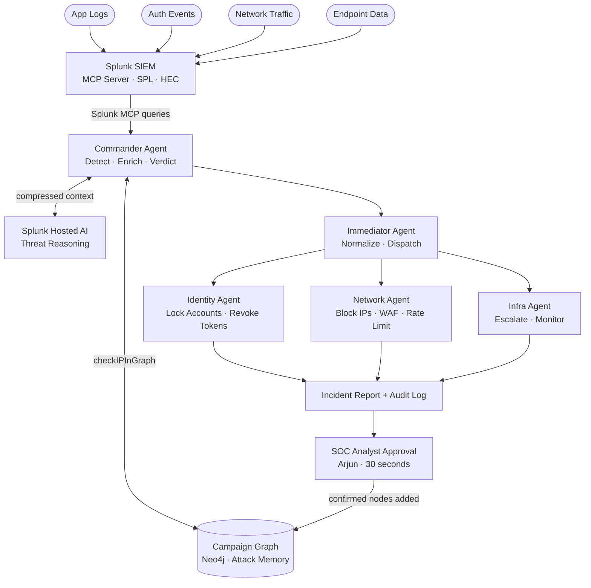
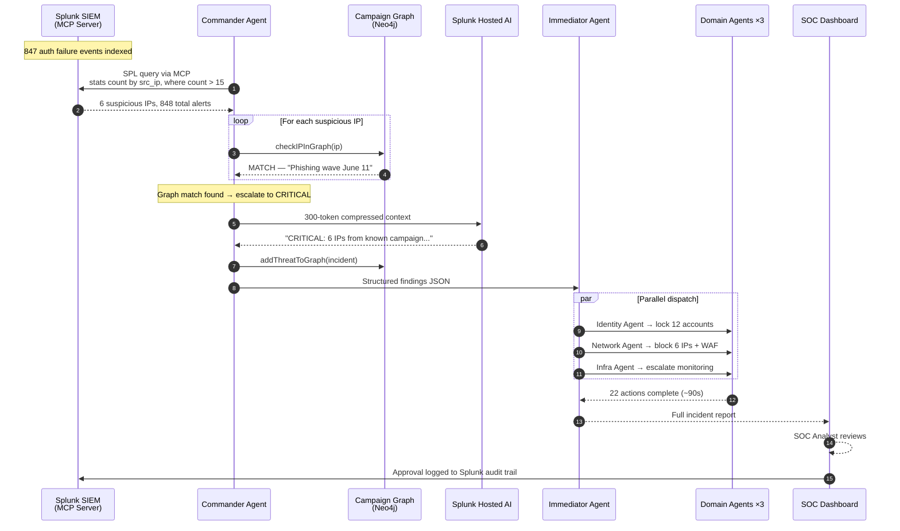
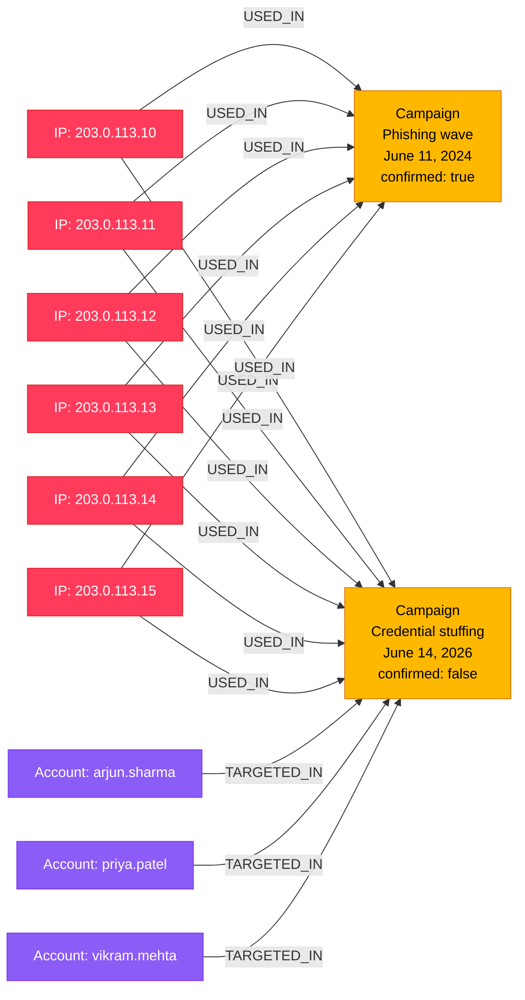

# ThreatPilot — Architecture

> **Autonomous Agentic SOC on Splunk** · Security Track · Splunk Agentic Ops Hackathon 2025

---

## System Overview



## Agent Pipeline — Detailed Flow



---

## Campaign Knowledge Graph — Schema



> **This is the key innovation.** When IP `203.0.113.10` appears in tonight's attack, ThreatPilot traces the edge back to `Campaign: Phishing wave June 11`. This is a known attacker — second strike. Severity escalates to CRITICAL instantly.

---

## Data Flow

```mermaid
flowchart LR
    classDef data   fill:#1a1d27,stroke:#00D4FF,color:#00D4FF
    classDef proc   fill:#1a1d27,stroke:#8B5CF6,color:#8B5CF6
    classDef store  fill:#1a1d27,stroke:#FFB800,color:#FFB800
    classDef out    fill:#1a1d27,stroke:#00FF88,color:#00FF88

    RAW["Raw logs\n847 events\nJSON via HEC"]:::data
    IDX["Splunk Index\nmain · auth_events\nSPL searchable"]:::store
    SPL["SPL Query\nstats count by src_ip\nwhere count > 15"]:::proc
    CLU["6 clusters\n166/152/144/137\n128/121 failures"]:::data
    GQ["Graph Query\ncheckIPInGraph\nCypher MATCH"]:::proc
    GM["Graph Match\nCAMP-2024-001\nPhishing wave"]:::store
    CTX["Compressed context\n~300 tokens\nNot 30k raw logs"]:::data
    VD["AI Verdict\nCRITICAL severity\nPlain English"]:::proc
    ACT["22 Actions\n12 locked · 6 blocked\n+ escalation"]:::out
    RPT["Incident Report\n1 document\nreplaces 847 alerts"]:::out

    RAW --> IDX --> SPL --> CLU --> GQ --> GM
    GM --> CTX --> VD --> ACT --> RPT
```



---

## Component Responsibilities

| Component | File | Responsibility |
|-----------|------|---------------|
| **Commander Agent** | `src/agents/commander.js` | Queries Splunk via MCP every cycle, cross-references IPs with Campaign Graph, calls Splunk AI for verdict |
| **Immediator Agent** | `src/agents/immediator.js` | Receives Commander findings, normalises severity, dispatches to all three domain agents in parallel |
| **Identity Agent** | `src/agents/identity-agent.js` | Locks all targeted accounts, revokes active sessions and tokens |
| **Network Agent** | `src/agents/network-agent.js` | Blocks malicious IPs via WAF rules, applies rate limiting to auth service |
| **Infra Agent** | `src/agents/infra-agent.js` | Escalates monitoring level, increases log verbosity across all services |
| **Splunk MCP Interface** | `src/splunk/mcp.js` | Wraps Splunk REST API for agent queries — SPL search job creation, polling, result extraction |
| **Campaign Graph** | `src/graph/queries.js` | Neo4j queries — checkIPInGraph(), addThreatToGraph(), getCampaignContext() |
| **API Server** | `src/api/server.js` | Express endpoints — run-detection, get incident, approve, health check |
| **SOC Dashboard** | `frontend/src/App.jsx` | React dashboard — live polling, Cytoscape graph, approval workflow |

---

## Splunk Integration Points

```
┌─────────────────────────────────────────────────────────┐
│                    SPLUNK ENTERPRISE                     │
│                                                         │
│  ┌──────────┐  ┌──────────┐  ┌──────────────────────┐  │
│  │   HEC    │  │ REST API │  │   MCP Server         │  │
│  │ :8088    │  │  :8089   │  │   Agent interface    │  │
│  └────┬─────┘  └────┬─────┘  └──────────┬───────────┘  │
│       │              │                   │              │
│       ▼              ▼                   ▼              │
│  [Log ingestion] [Search jobs]    [Agent queries]       │
│  generate-logs   /services/       Commander Agent       │
│  .py → 847       search/jobs      asks questions,       │
│  events          SPL execution    Splunk answers        │
│                                                         │
│  ┌──────────────────────────────────────────────────┐   │
│  │              Splunk AI Assistant                 │   │
│  │  SOC analyst asks: "What did these IPs do       │   │
│  │  in the last 30 days?" → natural language        │   │
│  │  answer powered by Splunk hosted AI              │   │
│  └──────────────────────────────────────────────────┘   │
└─────────────────────────────────────────────────────────┘
```

---

## Why ThreatPilot Wins on Splunk

| Capability | How ThreatPilot Uses It |
|-----------|------------------------|
| **Splunk MCP Server** | Commander Agent's primary query interface — agents speak to Splunk via MCP protocol |
| **Splunk Hosted AI** | Threat reasoning engine — receives compressed graph context, returns structured verdict |
| **Splunk AI Assistant** | SOC analyst chat interface — natural language queries over incident data |
| **Splunk HEC** | Log ingestion pipeline — all attack events pushed to Splunk in real-time |
| **Splunk SPL** | Pattern detection — `stats count by src_ip | where count > 15 | eval severity` |
| **Splunk Audit Trail** | Every agent action logged back to Splunk for compliance and review |

---

<div align="center">

*Every other SOC tool answers: "What is this alert?"*

*ThreatPilot answers: "Have we seen this attacker before — and what are they really doing?"*

</div>